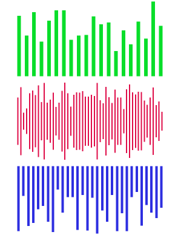

# WaveView

[]//(https://travis-ci.org/Howtin/PhoenixSwiftAPIClient)
[]//(http://cocoapods.org/pods/PhoenixSwiftAPIClient)
[]//(http://cocoapods.org/pods/PhoenixSwiftAPIClient)
[]//(http://cocoapods.org/pods/PhoenixSwiftAPIClient)

# effect


## Usage

'pod 'ZMWaveView''

## Requirements

## Installation

```ruby
pod "ZMWaveView"
```

## Author

Zeng Mo, zengxianshu0@163.com

## License

PhoenixSwiftAPIClient is available under the MIT license. See the LICENSE file for more info.
